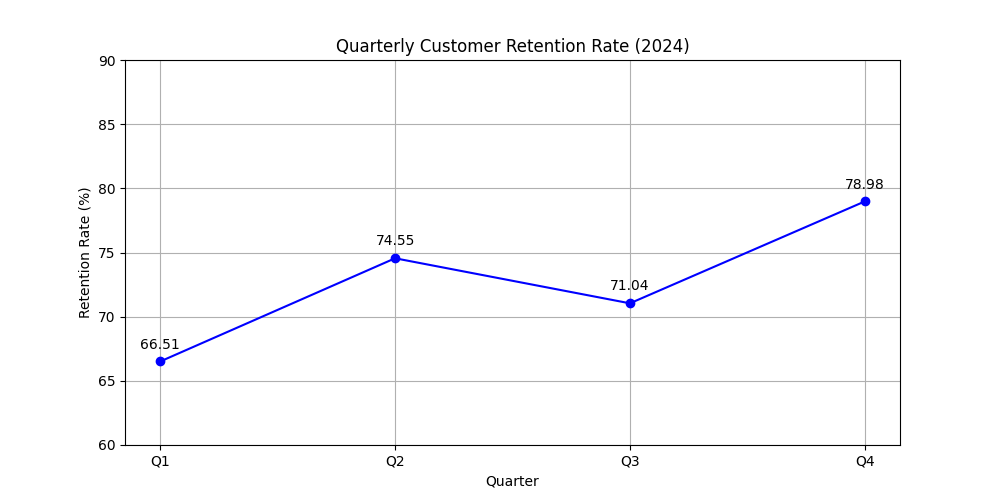
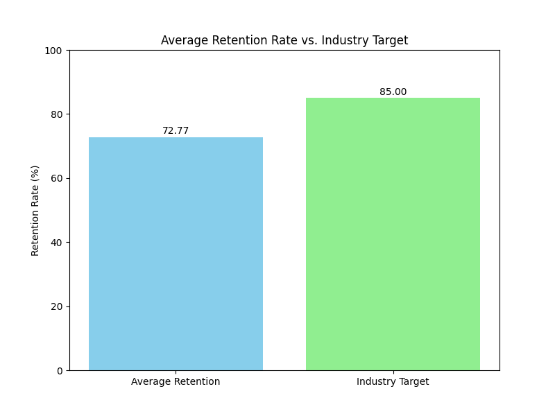

# Customer Retention Analysis and Strategy

**Contact Email:** 23f2001992@ds.study.iitm.ac.in

## 1. Executive Summary

This report analyzes the customer retention rates for the fiscal year 2024. The average retention rate currently stands at **72.77%**, which is significantly below the industry target of **85%**. This analysis highlights a critical need to improve customer loyalty and reduce churn. This document outlines the key findings, business implications, and a strategic recommendation to address this gap.

## 2. Data Analysis and Key Findings

The quarterly retention rates for 2024 are as follows:
- **Q1:** 66.51%
- **Q2:** 74.55%
- **Q3:** 71.04%
- **Q4:** 78.98%

The average retention rate for the year is **72.77%**.

### Quarterly Retention Trend

The trend shows a general upward movement in retention throughout the year, with a notable peak in Q4. However, there was a dip in Q3, which warrants further investigation. Despite the positive trend, the overall performance is not sufficient to meet the industry benchmark.

### Benchmark Comparison

As illustrated in the chart, our average retention rate is more than 12 percentage points below the industry target of 85%. This gap represents a significant opportunity for growth and improvement.

## 3. Business Implications

A lower-than-average retention rate has several negative implications for the business:

*   **Reduced Revenue:** Acquiring new customers is often more expensive than retaining existing ones. A high churn rate directly impacts long-term revenue stability.
*   **Increased Costs:** Higher marketing and sales expenditures are required to replace lost customers.
*   **Negative Brand Perception:** Dissatisfied customers who leave may share their negative experiences, harming the brand's reputation.
*   **Missed Growth Opportunities:** A loyal customer base is a source of upselling, cross-selling, and valuable feedback.

## 4. Recommendations to Reach the 85% Target

To bridge the gap and achieve the 85% retention target, a proactive and data-driven approach is essential.

**The Solution: Implement Targeted Retention Campaigns**

Instead of a one-size-fits-all approach, we recommend segmenting customers based on their behavior, demographics, and feedback. By understanding the unique needs and pain points of different customer groups, we can create tailored campaigns to enhance their experience and loyalty.

### Actionable Steps:

1.  **Customer Segmentation:**
    *   Identify high-value customers who are at risk of churning.
    *   Group customers based on their engagement levels, purchase history, and support interactions.

2.  **Personalized Communication:**
    *   Develop targeted email marketing campaigns with personalized offers and content.
    *   Implement a proactive outreach program for at-risk customers.

3.  **Enhance Onboarding:**
    *   Improve the new customer onboarding process to ensure a strong start.
    *   Provide clear guidance and support during the initial stages of the customer journey.

4.  **Feedback and Improvement:**
    *   Systematically collect and analyze customer feedback to identify common issues.
    *   Use insights from feedback to make continuous improvements to products and services.

By implementing these targeted retention strategies, we can foster stronger customer relationships, reduce churn, and work steadily towards our goal of an 85% retention rate.
