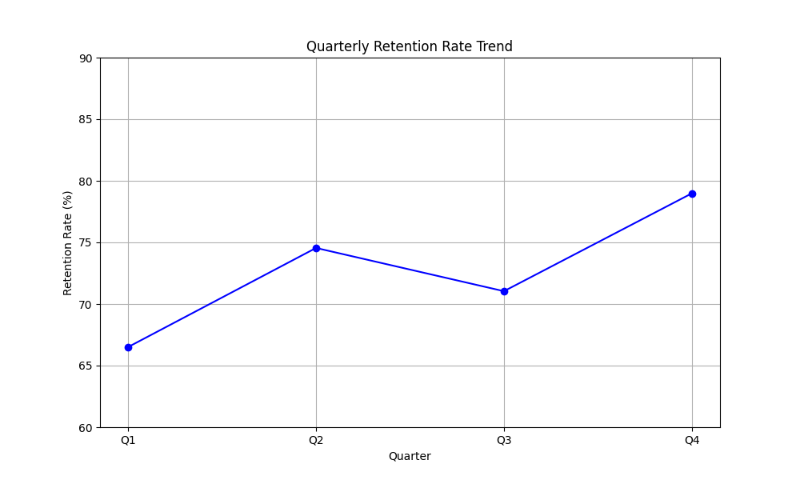
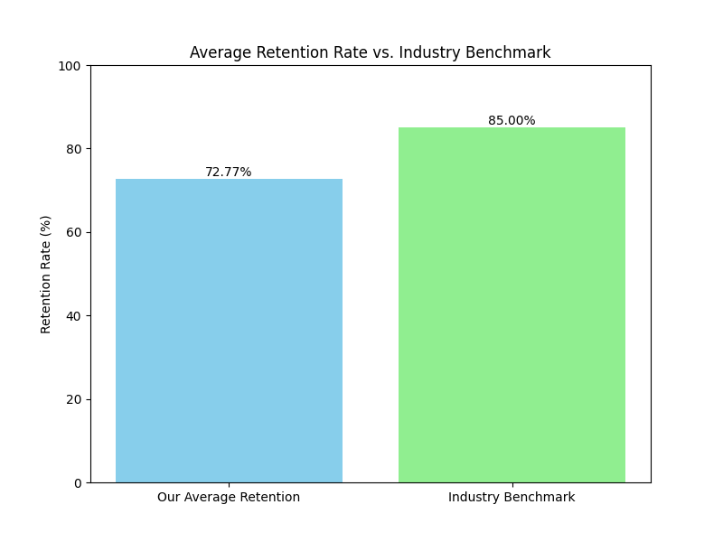

# Quarterly Retention Analysis

This repository contains an analysis of the company's quarterly user retention rates. The analysis aims to identify trends, compare our performance against the industry benchmark, and provide actionable recommendations to improve retention.

## Key Findings

The average quarterly retention rate is **72.77%**. While there was a significant increase in retention from Q1 to Q2, the overall trend shows that our retention rate is consistently below the industry benchmark of 85%. This indicates a critical need for strategic interventions to boost user loyalty and engagement.

## Business Implications

A lower-than-average retention rate has significant business implications:

*   **Increased Customer Acquisition Costs:** Acquiring new customers is more expensive than retaining existing ones. A low retention rate forces the company to spend more on marketing and sales to maintain its customer base.
*   **Reduced Customer Lifetime Value:** Retained customers are more likely to make repeat purchases and upgrade their services, increasing their lifetime value. Poor retention directly impacts this long-term revenue stream.
*   **Negative Brand Perception:** High churn can be an indicator of customer dissatisfaction, which can harm the brand's reputation and make it harder to attract new customers.

## Recommendations

To address the declining retention rate and bridge the gap with the industry benchmark, we recommend the following:

1.  **Enhance Onboarding Experience:** A smooth and engaging onboarding process can significantly improve long-term user retention. We should analyze the current onboarding flow to identify and eliminate any friction points.
2.  **Implement Targeted Retention Campaigns:** Proactively engage with at-risk users by offering personalized incentives, educational content, and support. This can help re-engage users who are showing signs of churning.
3.  **Improve Customer Support:** Providing timely and effective customer support is crucial for building trust and loyalty. We should invest in training our support team and implementing more efficient support channels.
4.  **Gather and Act on User Feedback:** Regularly collect feedback through surveys and user interviews to understand their pain points and expectations. Use this feedback to prioritize product improvements and new features.

## Verification

For any questions or verification, please contact: **23f2001992@ds.study.iitm.ac.in**

This analysis was performed using Codex, as referenced in [https://chatgpt.com/codex/tasks](https://chatgpt.com/codex/tasks).
